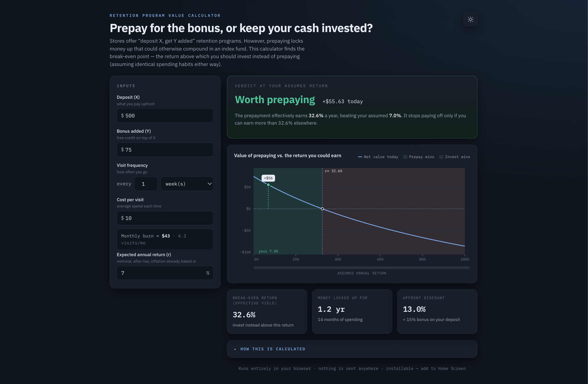
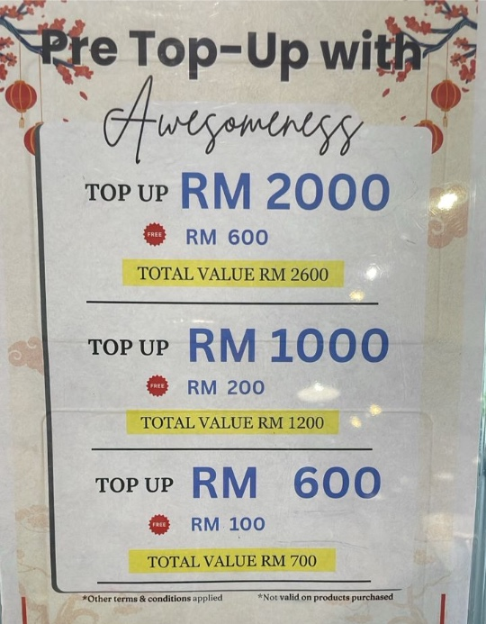
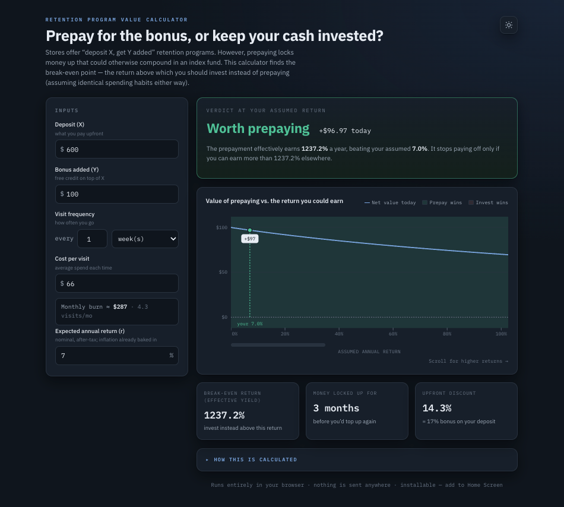

# Retention Program Value Calculator

> Should you prepay for a store's loyalty bonus, or keep your cash invested? This tool finds the break-even return.

**[→ Try it live](https://zachtheyek.github.io/prepay_calculator/)**

<p align="center">
  
  <br>
  <em>Calculator example.</em>
</p>

## What it does

Stores often offer "deposit \$X, get \$Y added" retention programs. The bonus is real, but prepaying locks up money that could otherwise be compounding in an index fund — and the longer it takes you to spend the balance down, the more growth you give up.

This single-page app reframes the bonus as an investment and answers one question: **at what expected return does investing beat prepaying?** You enter the deposit, the bonus, how often you visit and what you spend, and your expected return — it tells you which option leaves you better off, and by how much in today's dollars.

## How it works

Both options buy the same things at the same times — your visits don't change with how you pay — so what you're really choosing between is two ways to _finance_ the same spending. The cheaper financing wins.

- **Prepay:** pay `X` today, then draw down a balance of `X + Y`. Cost in today's money: `X`.
- **Stay invested:** keep `X` compounding at your expected return `r` and pay out of pocket as you go.

The app computes the present value of each cash flow and solves for the **break-even return** `r*` — the effective annual yield (IRR) the prepaid dollars earn. If you expect to beat `r*` in the market, invest; if not, prepay.

A useful rule of thumb (the app solves it exactly via bisection on the net present value):

```
r* ≈ 2d / T        d = Y / (X + Y)        T = (X + Y) / (12·m)
```

where `d` is the upfront discount, `T` is the drawdown horizon in years, and `m` is your monthly spend. The takeaway: what matters most is **how long your deposit stays locked up** — not the headline bonus percentage.

## Example: a real salon promotion

A hair salon runs a "pre top-up" promotion with three tiers:

<p align="center">
  
</p>

Suppose you spend roughly \$66 a visit, about once a week — call it ~\$287/month. Holding that spend fixed and running each tier through the calculator:

<table align="center">
  <tr>
    <td></td>
    <td></td>
    <td></td>
  </tr>
  <tr>
    <td colspan="3" align="center">
      <em>Comparison of the three promotion tier structures. (left) 17% bonus, 1,237% effective yield, ~3 months lockup period, +$97 net value today. (center) 20% bonus, 321% effective yield, ~5 months lockup period, +$189 net value today. (right) 30% bonus, 129% effective yield, ~10 months lockup period, +$542 net value today.</em>
    </td>
  </tr>
</table>

### Step 1 — Prepay, or invest the cash instead?

The effective yield (break-even return) is the annual return the prepaid money effectively earns. Prepay only if you _can't_ beat that return in the market; otherwise keep the cash invested and pay as you go. My expected after-tax market return is ~7%, and **every tier's yield dwarfs it** — 129% even at worst. So for money I'm going to spend at this salon anyway, prepaying beats investing at all three tiers; parking my haircut budget in an index fund and paying out of pocket would leave money on the table.

### Step 2 — Which tier is the best value?

This is where two different senses of "value" pull apart:

- **Discount per dollar committed** (the bonus) _rises_ with tier size: 17% → 20% → 30%. The RM 2,000 tier hands back the most free credit per dollar and saves the most in absolute terms — +\$542 in today's money, the largest of the three. Even after annualizing for the fact that the smaller tiers cycle faster (you re-top up more often), it still comes out ahead: roughly \$700/year for tier C versus ~\$480/year for tier A.
- **Return per dollar-year locked up** (the effective yield) _falls_ with tier size: 1,237% → 321% → 129%.
  They diverge because the bigger tiers buy a deeper discount but make you _wait longer_ to realize it — \$2,000 takes ~10 months to draw down versus ~3 months for \$600 — so the annualized return on that locked capital is lower even though the headline discount is higher. (This is the `r* ≈ 2d / T` relationship above in action: a larger discount `d` on top, but a much longer lock-up `T` underneath, and the lock-up wins. The formula is only a rough, small-rate approximation — it badly understates the yield when the balance is spent in a month or two, which is why tier A's true yield is in the thousands of percent — but the _direction_ it predicts is exactly what the calculator confirms.)

So which tier wins? Because **all three clear my 7% hurdle by a wide margin, returns aren't the binding constraint — risk is.** Each step up captures a bigger discount but commits more cash to a single small business for longer, and a prepaid balance is an unsecured claim: if the salon closes, the unspent balance is gone. The effective yield is a _pre-risk_ number — 129% looks unbeatable next to 7%, but it doesn't price the chance of losing the balance outright.

The practical rule: **pick the largest tier whose deposit and lock-up you're comfortable having tied up in one shop.** If \$2,000 for ~10 months is more single-merchant exposure than you want, step down to \$1,000 (\~5 months) or \$600 (\~3 months) — you give up some savings, but every tier still beats investing. Effective yield earns its keep in the opposite case: a tier that locks a large deposit up for _years_ in exchange for a token bonus would fall _below_ your market return, and the calculator would correctly tell you to walk away and invest instead. That's the scenario it's built to catch — and the reason it leads with the break-even number.

## Features

- Exact break-even return, plus a sensitivity chart showing net value across the full range of returns
- Inputs in plain terms: deposit, bonus, visit frequency, cost per visit, expected return (monthly burn is derived for you)
- Three at-a-glance metrics: effective yield, capital lock-up horizon, and upfront discount
- Light/dark themes that follow your system, with a manual toggle
- Installable PWA — works offline and can be added to your home screen
- No dependencies, no build step, no tracking; runs entirely in your browser

## Assumptions

The model assumes your spending is the same either way, and uses your **after-tax** expected return (the bonus isn't taxed; investment gains are). It deliberately ignores a few things that all tilt the decision _toward_ investing: credit that expires unused, counterparty risk if the store folds, lock-in, and the tendency of a prepaid balance to nudge spending up. One factor cuts the other way — prepaying hedges against future price increases at that store.

## Run locally

It's a static site with no build step.

```bash
git clone https://github.com/zachtheyek/prepay_calculator
cd prepay_calculator
python3 -m http.server 8000
# then open http://localhost:8000
```

Opening `index.html` directly works too, but serve it over `http://localhost` if you want the PWA/offline features — service workers don't run from `file://`.

### Install it on your phone

The app is a PWA, so you can add it to your home screen and launch it like a native app — it works offline once loaded.

**iPhone / iPad (Safari)**

1. Open the [live site](https://zachtheyek.github.io/prepay_calculator/) in Safari.
2. Tap the Share button (the square with an upward arrow).
3. Scroll down, tap **Add to Home Screen**, then **Add**.

**Android (Chrome)**

1. Open the [live site](https://zachtheyek.github.io/prepay_calculator/) in Chrome.
2. Tap the **⋮** menu (top right).
3. Tap **Add to Home screen** (or **Install app**), then confirm.

## Built with

- Vanilla JavaScript in a single `index.html` — no framework, no build
- A hand-drawn SVG chart (no charting library)
- IBM Plex Sans / Mono
- PWA shell: `manifest.webmanifest` + `sw.js` (offline app shell with a runtime font cache)
- Hosted on GitHub Pages

## License

Released under the [MIT License](LICENSE).
